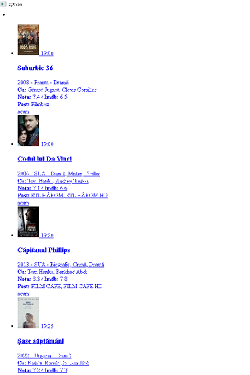

"catafest_ro_tv script with PyQt6 and Python 3.12.1" 

#### Simple extraction of the TV program with movies by the current date and current time from
#### https://m.cinemagia.ro/filme-la-tv/toate-posturile/

The source code needs to be improved, but it works well too.

The result is like the next image :

